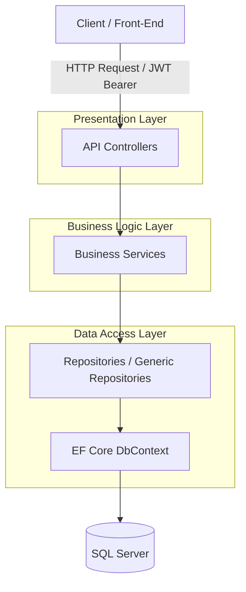

# MES (Manufacturing Execution System) Server 

**스마트 팩토리 운영을 위한 생산 실행 시스템(MES) 서버**

본 프로젝트는 생산 현장의 실시간 데이터 흐름을 관리하고, 생산 지시부터 공정 실적 추적(Traceability), 설비 공구 관리까지 아우르는 데이터 기반의 MES 서버입니다. 기존 프론트엔드 개발 경험을 바탕으로, 제조 도메인 지식을 녹여내어 데이터의 무결성과 추적성을 확보하는 데 중점을 두었습니다.

---

##  Tech Stack & Architecture
* **Language**: C#, .NET 8.0 (LTS)
* **Framework**: ASP.NET Core Web API
* **ORM**: Entity Framework Core (Code First)
* **Database**: SQL Server
* **Authentication**: JWT Bearer Authentication
* **Tooling**: Visual Studio, Git, Swagger (OpenAPI)

### System Architecture
본 프로젝트는 레이어드 아키텍처(Layered Architecture)와 Repository 패턴을 결합하여, 비즈니스 로직과 데이터 액세스 레이어를 명확히 분리하고 코드 재사용성과 유지보수성을 극대화하였습니다.



---

##  세부 기술 및 설계 문서 (System Documentations)

프로젝트 설계에 대한 구체적인 비즈니스 흐름 및 기술 상세 내용은 아래 문서들에서 확인하실 수 있습니다:

1. **[도메인 시나리오 & 데이터 흐름 가이드 (docs/domain-scenario.md)](file:///C:/Users/User/Desktop/ASP.NET/mes_back/mes_server/docs/domain-scenario.md)**
   - 작업지시 발행, 실시간 LOT 발급 및 추적(Traceability), 공정 이동 및 BOM 자재 자동차감 등의 실무 제조 프로세스 시나리오 가이드
2. **[데이터베이스 스키마 & ERD 명세서 (docs/database-erd.md)](file:///C:/Users/User/Desktop/ASP.NET/mes_back/mes_server/docs/database-erd.md)**
   - BOM, Lot, WorkOrder, Performance 등 테이블 간 맵핑과 Cascade Delete 방지를 위한 제약 조건 설계 설명
3. **[API 응답 표준 및 JWT 인증 가이드 (docs/api-standards.md)](file:///C:/Users/User/Desktop/ASP.NET/mes_back/mes_server/docs/api-standards.md)**
   - 공통 응답 규격, 예외 처리 규칙 및 Swagger 사용법

---

##  핵심 구현 특징

### 1. 트랜잭션 기반 공정 이동 (`MoveProcessAsync`)
* 실적 등록(`RegisterPerformanceAsync`)과 다음 공정 이동(`ChangeLotProcessAsync`) 작업을 하나의 DB 트랜잭션으로 묶어 원자성(Atomicity)을 보장함으로써, 네트워크 장애 또는 로직 도중 오류 시 발생할 수 있는 데이터 불일치를 원천 차단했습니다.
* 관련 코드: [ProductionService.cs](file:///C:/Users/User/Desktop/ASP.NET/mes_back/mes_server/Services/ProductionService.cs#L252-L269)

### 2. BOM 기반 실시간 자재 자동 소모 (`ConsumeMaterialByProcessAsync`)
* 공정 진행 시, 해당 공정에 투입되도록 설계된 BOM(자재 명세서) 정보와 실적 수량을 바탕으로 창고 재고를 실시간으로 자동차감(Backflushing) 처리합니다.
* 관련 코드: [InventoryService.cs](file:///C:/Users/User/Desktop/ASP.NET/mes_back/mes_server/Services/InventoryService.cs#L45-L63)

### 3. 설비 및 공구 예방 점검 알림 (`UseToolAsync`)
* 실적 등록 시 함께 사용된 설비공구(Tool)의 사용 카운트를 자동 누적하며, 한계 수명 대비 90% 이상 도달 시 경고(`Warning`), 100% 도달 시 작업 대기(`ReplaceWait`) 상태로 전환하여 현장 오작동을 선제 차단합니다.
* 관련 코드: [ToolService.cs](file:///C:/Users/User/Desktop/ASP.NET/mes_back/mes_server/Services/ToolService.cs#L45-L71)

---

## 📁 폴더 구조 (Layered Architecture)
```text
mes_server/
├── docs/              # 시스템 설계 및 시나리오 상세 문서
├── Controllers/       # API 엔드포인트 제어 (JWT 인증 적용)
│   ├── ProductionController.cs
│   └── ...
├── Data/              # DbContext 및 마이그레이션 이력
│   └── MESDbContext.cs
├── Models/            # 핵심 도메인 Entity & DTO & 공통 Enum
├── Repositories/      # Generic 및 Custom Repository 구현부
└── Services/          # 비즈니스 로직 및 트랜잭션 처리부
```

---

##  시작 가이드 (Getting Started)

### 1. 환경 설정 및 DB 구성
로컬에 SQL Server가 구성되어 있어야 하며, [appsettings.json](file:///C:/Users/User/Desktop/ASP.NET/mes_back/mes_server/appsettings.json) 파일에 접속 정보를 업데이트해야 합니다.
```bash
# Package Manager Console
Update-Database
# 또는 .NET CLI
dotnet ef database update
```

### 2. 프로젝트 빌드 및 실행
```bash
dotnet restore
dotnet build
dotnet run
```
* 서버가 정상 실행되면 `http://localhost:<PORT>/swagger` 경로를 통해 인터랙티브 API 테스트 화면에 진입할 수 있습니다.
* API 인가 테스트 시, [api-standards.md](file:///C:/Users/User/Desktop/ASP.NET/mes_back/mes_server/docs/api-standards.md)에 기술된 인증 가이드를 참고해 주세요.