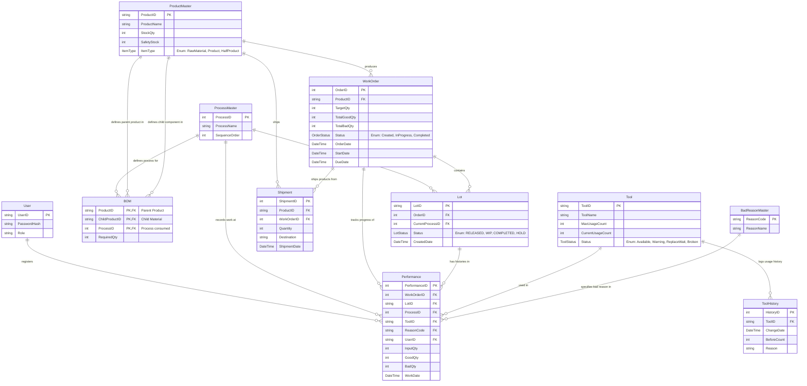

# Database Schema & ERD (Entity Relationship Diagram) 

이 문서는 본 MES 서버 프로젝트에서 데이터의 무결성과 추적성을 확보하기 위해 설계된 데이터베이스 모델 및 엔티티 간 연관 관계를 설명합니다.

---

## 📊 ER Diagram (Entity Relationship Diagram)

아래 다이어그램은 Entity Framework Core의 Fluent API 설계를 기반으로 작성된 테이블 간의 관계입니다.



---

## 🔍 핵심 테이블 설계 특징

### 1. BOM(Bill of Materials) 복합키 및 연관관계 설계
* **구조**: `BOM` 테이블은 어떤 제품(`ProductID`)을 만들기 위해 어떤 공정(`ProcessID`)에서 어떤 원재료(`ChildProductID`)가 사용되는지를 복합키로 관리합니다.
* **EF Core Fluent API**:
  ```csharp
  modelBuilder.Entity<BOM>()
      .HasKey(b => new { b.ProductID, b.ChildProductID, b.ProcessID });
  ```
* **무결성 제약 조건**: 상위 품목이나 하위 자재가 삭제되어 BOM 데이터가 고아가 되는 현상을 방지하기 위해 `OnDelete(DeleteBehavior.Restrict)` 제약조건이 적용되어 있습니다.

### 2. 생산 실적(Performance) 및 LOT 추적
* **Lot Traceability**: 생산 실적이 기록될 때마다 어떤 LOT이 어느 공정에서 누구에 의해 작업되었고, 어떤 설비 공구(Tool)가 사용되었는지 `Performance` 이력 테이블에 영구히 보관됩니다.
* **공정 진행**: `Lot`은 현재 진행 상태인 `CurrentProcessID`를 들고 있으며, 작업이 끝날 때마다 다음 공정으로 갱신됩니다.

### 3. 설비 공구(Tool) 상태 및 이력 관리
* 공정 실적 등록 시 사용된 `Tool`의 수명 타수가 증가합니다.
* 공구의 이력은 별도의 `ToolHistory` 테이블에 기록되어, 공구 수명 주기(Life Cycle) 분석 및 예방 보전(Preventive Maintenance)에 활용될 수 있도록 설계되었습니다.

### 4. 외래키 Cascade 삭제 제약 (`DeleteBehavior.Restrict`)
* 제조 도메인에서는 한 번 생성된 기준 정보(마스터 데이터)나 실적 데이터가 임의로 삭제되어 데이터 무결성이 손상되는 것을 철저히 차단해야 합니다.
* 본 프로젝트의 `MESDbContext` 내 모든 엔티티 연관관계 설계에는 EF Core의 기본값인 Cascade(연쇄 삭제) 대신 **`Restrict`**를 명시적으로 적용하여 하위 이력이 존재하는 마스터 데이터의 무작위 삭제를 엄격히 제한하고 있습니다.
