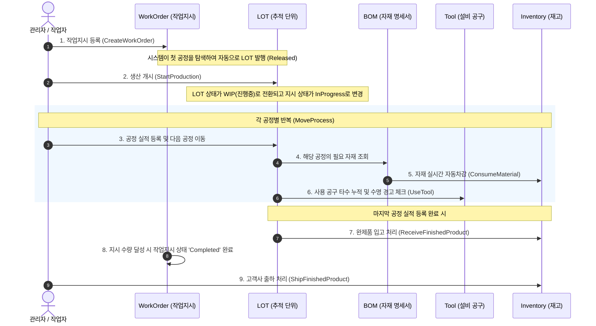

# MES Domain Scenario & Data Flow Guide 🏭

이 문서는 본 MES(생산실행시스템) 서버에서 비즈니스 로직이 어떻게 흘러가는지, 실제 제조업 공정의 라이프사이클에 맞춰 API 호출 흐름과 데이터의 변화를 설명합니다.

---

## 🔄 스마트 팩토리 제조 실행 시나리오 흐름도
MES 서버의 핵심 시나리오는 **"작업지시 등록 ➔ 생산 준비 ➔ 실적 등록 및 자재 차감 ➔ 공정 이동 및 툴 수명 집계 ➔ 생산 완료 및 완제품 출하"**의 순서로 진행됩니다.

---

## 🛠 단계별 상세 시나리오 및 API 가이드

### 1단계: 기준 정보(Master Data) 설정
생산 활동을 시작하기 전, 공장 기준 정보가 정의되어야 합니다.
* **사용자 등록**: 작업 실적을 등록할 작업자 계정을 생성합니다.
* **품목 등록**: 생산할 '제품'과 투입할 '원자재/부자재'를 등록합니다.
* **공정 마스터 구성**: 제품이 거쳐 갈 공정(Process)과 그 순서(SequenceOrder)를 정의합니다.
* **BOM 구성**: 제품(Product)을 만들기 위해 어떤 공정(Process)에서 어떤 원자재(ChildProduct)가 몇 개(RequiredQty) 소모되는지 맵핑합니다.

---

### 2단계: 작업지시(WorkOrder) 생성 및 LOT 자동 발행
* **API 호출**: `POST /api/Production/order`
* **동작**:
  1. 관리자가 생산할 제품(`ProductID`)과 목표 수량(`TargetQty`)을 입력하여 작업지시를 생성합니다.
  2. 시스템은 해당 제품의 공정 중 가장 첫 번째 공정(SequenceOrder가 가장 낮은 공정)을 조회합니다.
  3. 첫 번째 공정에 대기 중인 고유한 **LOT ID**를 가진 LOT 객체(`RELEASED` 상태)를 자동으로 발행하여 추적의 기준을 세웁니다.

---

### 3단계: 생산 시작 (Start Production)
* **API 호출**: `POST /api/Production/order/{orderId}/start`
* **동작**:
  1. 작업지시의 상태가 `Created`에서 `InProgress`로 변경됩니다.
  2. 작업에 연관된 LOT의 상태가 `RELEASED`에서 **`WIP` (Work In Progress, 진행 중)**으로 전환되며 본격적인 공정 가동이 시작됩니다.

---

### 4단계: 실적 등록 및 공정 이동 (Move Process & BOM Auto-Consumption)
작업자는 각 공정을 완료할 때마다 실적을 등록하고 LOT을 다음 공정으로 이동시킵니다. 데이터 정합성을 위해 두 작업은 하나의 DB 트랜잭션으로 묶여 실행됩니다.
* **API 호출**: `POST /api/Production/lot/move` (내부적으로 `RegisterPerformanceAsync` 및 `ChangeLotProcessAsync` 수행)
* **비즈니스 룰**:
  * **자재 자동차감(Backflushing)**: 실적이 등록되면, 시스템은 등록된 공정과 제품 ID에 맵핑된 BOM을 조회하고, 소요된 원자재 수량을 계산하여 재고(`ProductMaster.StockQty`)에서 **실시간으로 차감**합니다.
  * **불량 및 보류(HOLD) 처리**: 공정 중 불량 수량(`BadQty`)이 1개라도 발생하면 해당 LOT의 상태는 즉시 **`HOLD`**로 전환됩니다. 보류된 LOT은 보류 해제 또는 재작업 처리가 완료될 때까지 다음 공정으로 넘어갈 수 없습니다.
  * **공구 수명 추적**: 공정에 사용된 공구(`ToolID`)가 있을 경우 공구 사용 타수가 누적되며, 최대 수명 대비 90% 이상 도달 시 `Warning` 상태로, 100% 도달 시 `ReplaceWait` 상태로 변경되어 작업자에게 교체 필요성을 알립니다.
  * **공정 순서 검증**: 현재 공정에서 다음 공정으로 이동할 때, 순서(`SequenceOrder`)가 차례대로 이어지는 올바른 경로인지 검증합니다.

---

### 5단계: 완제품 입고 및 작업지시 완료
* **API 호출**: 공정 이동 API 가 마지막 공정(`lastProcessId`)에서 호출될 때 자동으로 연계 동작합니다.
* **동작**:
  1. 마지막 공정 실적이 성공적으로 등록되면 완성품 수량이 최종 누적됩니다.
  2. 완성품 수량만큼 제품 재고(`StockQty`)가 자동으로 증가합니다.
  3. 누적 양품 수량(`TotalGoodQty`)이 작업지시의 목표 수량(`TargetQty`)에 도달하면, 해당 작업지시는 자동으로 **`Completed` (완료)** 처리됩니다.

---

### 6단계: 제품 출하 (Shipment)
* **API 호출**: `POST /api/Inventory/ship`
* **동작**:
  1. 생산 완료된 제품을 고객사로 출하합니다.
  2. 출하할 수량만큼 제품 재고(`StockQty`)가 차감되며, 출하 이력(`Shipment` 테이블)에 목적지(`Destination`)와 함께 상세 기록이 남습니다.
